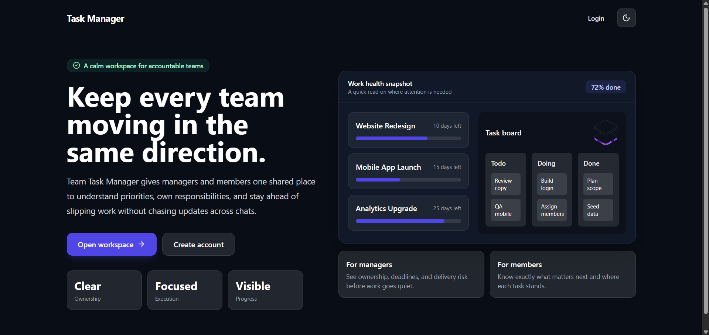
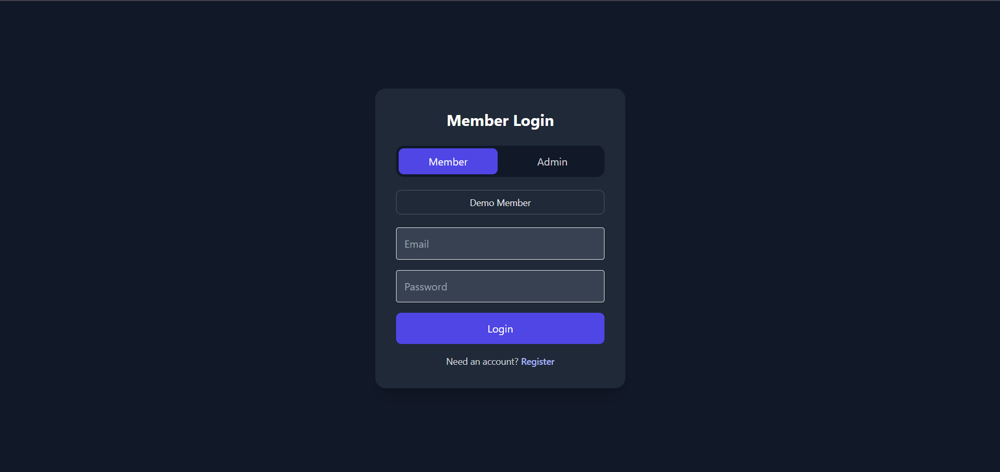
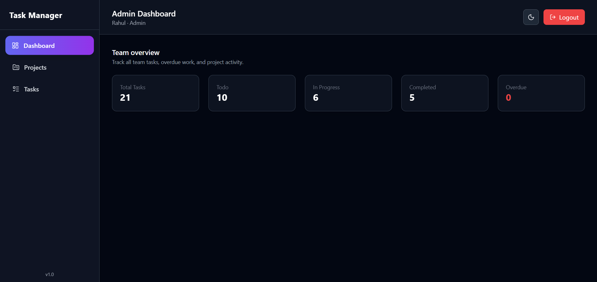
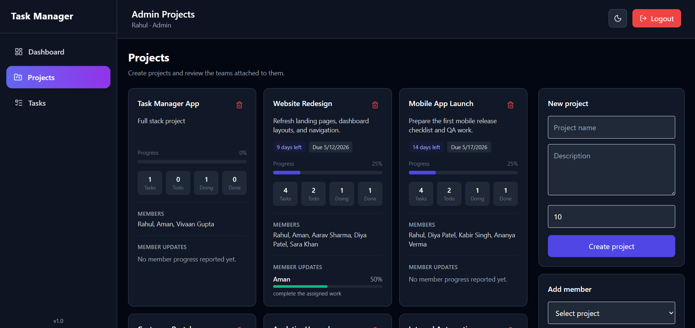
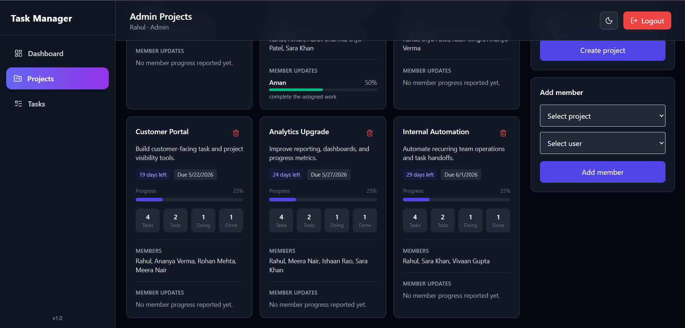
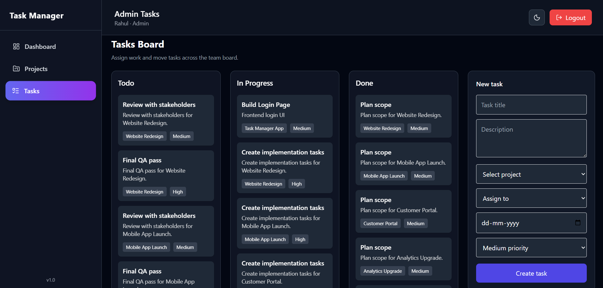
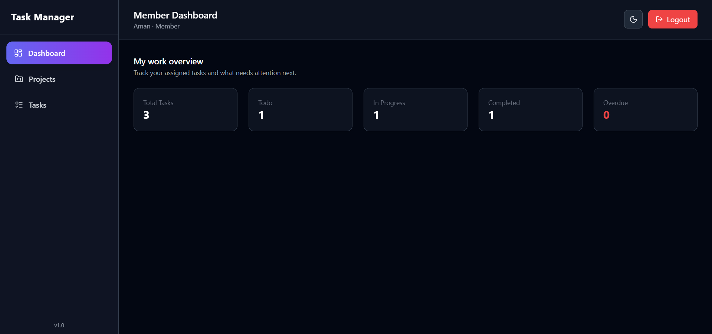
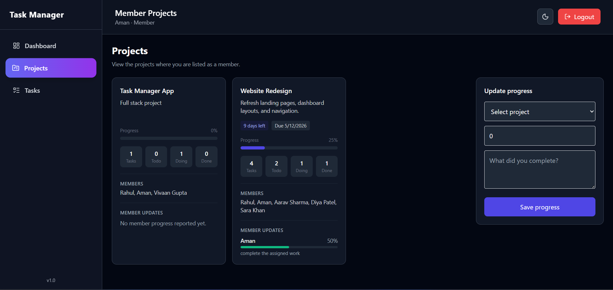
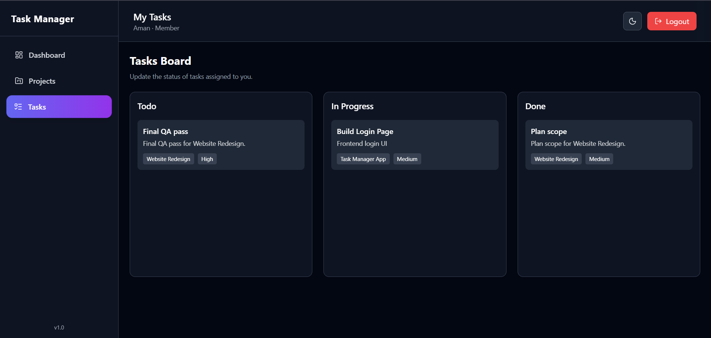
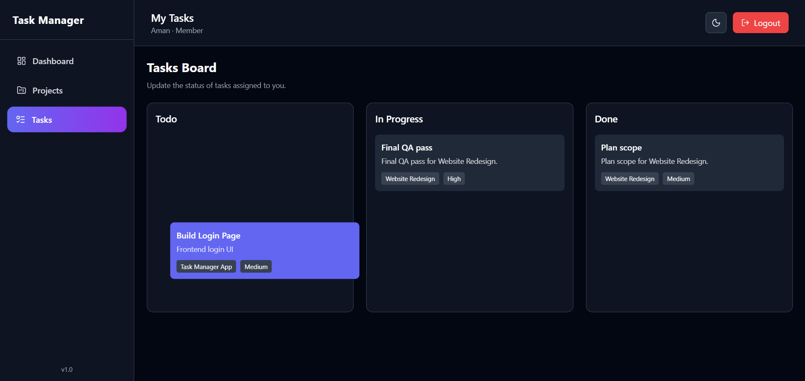

# 🚀 Team Task Manager (Full Stack MERN)

A modern, scalable **Team Task Management System** built using the **MERN stack (MongoDB, Express, React, Node.js)** with a premium UI, role-based access, and real-world workflow.

---

## 🌐 Live Demo

- 🔗 https://team-task-manager-nu-five.vercel.app/

---

## 📌 Overview

Team Task Manager is a full-stack web application that allows teams to collaborate efficiently.

It enables:
- Admins to manage projects, tasks, and team members  
- Members to track their assigned work  
- Teams to work in a structured workflow  

---

## ✨ Features

### 🔐 Authentication & Authorization
- JWT-based authentication  
- Role-based access:
  - Admin
  - Member  
- Protected routes  

---

### 📊 Admin Dashboard
- View:
  - Total Tasks  
  - Todo / In Progress / Completed  
  - Overdue Tasks  
- Track overall team performance  

---

### 📁 Project Management
- Create projects  
- Add description & deadlines  
- Assign members  
- Track progress  

---

### 📋 Task Management
- Create tasks with:
  - Title  
  - Description  
  - Priority (Low / Medium / High)  
  - Due Date  
- Assign tasks to users  

---

### 🧩 Kanban Task Board
- Columns:
  - Todo  
  - In Progress  
  - Done  
- Drag & drop tasks  
- Update status dynamically  

---

### 👤 Member Features
- View assigned projects  
- Track tasks  
- Update progress  
- Personalized dashboard  

---

### 🌙 UI/UX
- Dark Mode 🌙  
- Clean modern design  
- Sidebar navigation  
- Responsive layout  

---

## 🖼️ Web Application Overview
### Landing Page


### Login Page


### Admin Dashboard


### Admin Project View



### Admin Task Board


### Member Dashboard


### Member Project View


### Member Task Board


### Drag And Drop Feature



---

## 🏗️ Tech Stack

### Frontend
- React (Vite)  
- Tailwind CSS  
- Axios  
- React Router  
- @hello-pangea/dnd  

### Backend
- Node.js  
- Express.js  
- MongoDB Atlas  
- Mongoose  
- JWT  

---

## ⚙️ Environment Variables

### Backend (.env)

```
MONGO_URI=your_mongodb_connection
JWT_SECRET=your_secret_key
PORT=5000
```

### Frontend (.env)

```
VITE_API_URL=https://your-backend-url.onrender.com/api
```

---

## 🚀 Local Setup

### Clone Repo
```
git clone https://github.com/rahulkumar2112k/Team-Task-Manager.git
cd team-task-manager
```

### Backend
```
cd server
npm install
npm run dev
```

### Frontend
```
cd client
npm install
npm run dev
```

---

## 🚀 Deployment

### Backend (Render)
- Root: `server`
- Build: `npm install`
- Start: `npm start`

### Frontend (Vercel)
- Add env:
```
VITE_API_URL=https://your-backend-url.onrender.com/api
```

---

## 📂 Project Structure

```
team-task-manager/
│
├── client/
│
├── server/
│   ├── controllers/
│   ├── models/
│   ├── routes/
│   ├── middleware/
│
└── README.md
```

---

## 💡 Future Improvements

- Notifications  
- Calendar view  
- Analytics dashboard  
- Mobile optimization  
- AI-based suggestions  

---

## 👨‍💻 Author

Rahul Kumar  

---

## ⭐ Support

If you like this project:

- ⭐ Star the repo  
- 🍴 Fork it  
- 💬 Share feedback  

---

## 🏁 Conclusion

This project demonstrates:

- Full-stack MERN development  
- Role-based system  
- Clean UI/UX  
- Real-world team workflow  
---

🔥 Built with dedication
